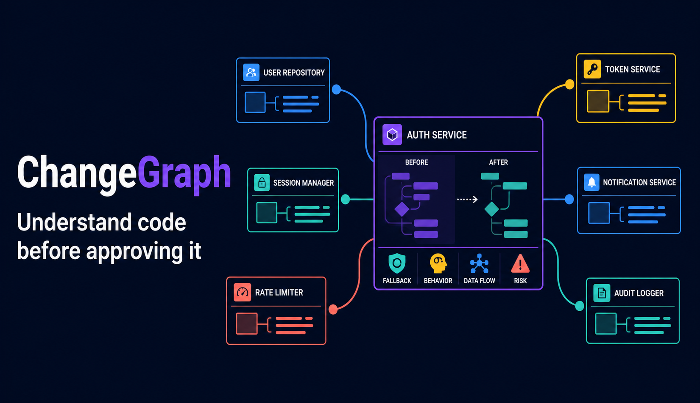
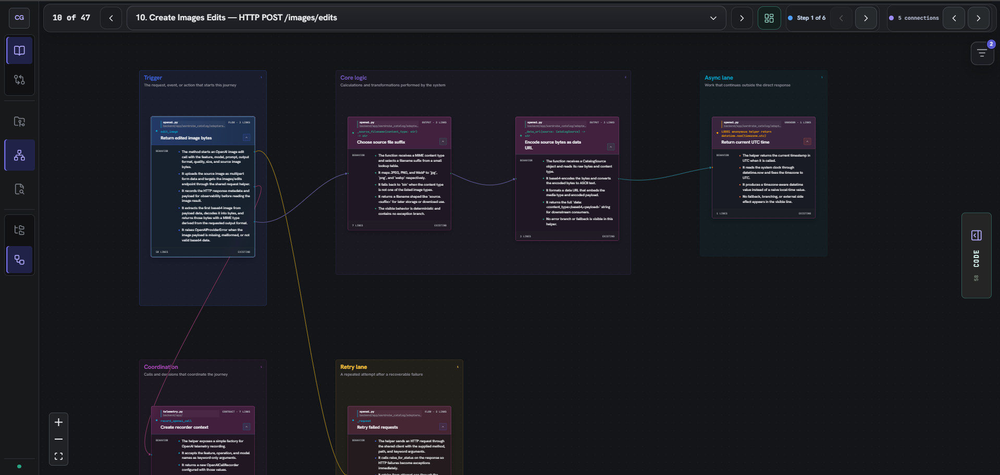
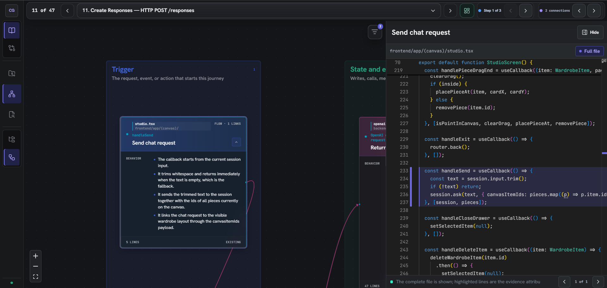

# ChangeGraph

ChangeGraph is a graph-first workspace for understanding an existing codebase before reviewing its changes. It turns repository source or a unified diff into a navigable map of behaviors, code structure, dependencies, execution journeys, fallbacks, errors, state, configuration, and external boundaries—while keeping every explanation linked to its source lines.



## Why ChangeGraph

AI coding agents can generate more code than a person can realistically review line by line. A summary is not enough: reviewers still need to know what changed, how it affects the system, which fallback and error paths exist, and where every claim comes from.

ChangeGraph provides two complementary views:

- **Structure** follows the repository hierarchy from system to subsystem, module, file, and behavior.
- **System behavior** presents end-to-end journeys across frontend, backend, persistence, queues, storage, and external systems.

Selecting a node opens its file in a side-by-side Monaco editor and highlights the exact evidence attributed to that behavior. Change analysis preserves the existing-code baseline and shows the concrete behavior before and after the diff.

## Core workflow

1. Select or index a local repository.
2. Build the **Baseline** map to understand the existing system.
3. Explore project structure or follow end-to-end behavior journeys.
4. Select nodes and edges to inspect their source evidence and relationships.
5. Build the **Change** map from a unified diff to review every changed behavior against the baseline.

ChangeGraph is intentionally language-agnostic. It reasons over source text and a deterministic line inventory instead of requiring an AST, compiler, parser, LSP, or Tree-sitter integration for every language.

## Features

- Repository-folder and pasted-source analysis
- Unified-diff review with explicit before/after behavior
- Hierarchical project exploration and cross-module HLD journeys
- Natural-language dependency edges describing what is exchanged
- Exact source-line attribution and full-file Monaco evidence view
- Explicit visibility for errors, fallbacks, state, outputs, configuration, and tests
- Collapsible, zoomable node-and-edge canvas with journey navigation
- Extension filters for hiding irrelevant file types
- Parallel background analysis with live progress
- Persistent graphs keyed by repository snapshot and prompt version
- Cached analysis reuse when source content has not changed
- OpenAI API and locally authenticated Codex provider paths
- Repo-local integrations for Codex and Claude Code

## Examples

### Follow an end-to-end system behavior

The behavior view organizes a journey into readable stages—such as trigger, core logic, async work, coordination, and retry paths—while preserving the connections between them.



### Trace an explanation back to code

Selecting a behavior opens the complete source file beside the graph and highlights the exact lines used as evidence, so the explanation can be verified without losing the surrounding code context.



## Requirements

- Node.js 22.13 or newer
- npm
- Git, when reviewing diffs or recording Git snapshot metadata
- Either an OpenAI API key or an authenticated local Codex installation for real analysis

## Run locally

Install dependencies:

```bash
npm install
```

Start the dashboard on the port expected by the local service:

```bash
npm run dev -- --port 3001
```

Open [http://localhost:3001](http://localhost:3001).

Demo mode is enabled by default and makes no external AI call. Turn it off in the repository screen when you are ready to use a real provider.

## AI providers

### OpenAI API

Create `.env.local` in the project root:

```dotenv
OPENAI_API_KEY=your_api_key
OPENAI_MODEL=gpt-5.4-mini
```

Restart the dashboard, disable demo mode, and select **OpenAI API**. Browser-originated API analysis is handled by the server route, so the key is never sent to the browser.

For agent-driven repository jobs through the local ChangeGraph service, start the bridge with the same environment file:

```bash
node --env-file=.env.local local-bridge/server.mjs
```

### Codex local

Install and authenticate Codex locally, then start the companion service in a second terminal:

```bash
npm run codex:bridge
```

Disable demo mode and select **Codex local**. The dashboard calls the loopback-only service at `127.0.0.1:47831`; the service uses the official Codex SDK and the user's local Codex authentication.

Provider paths are explicit. If the selected provider fails, ChangeGraph reports the error and does not silently send source code to the other provider.

## Agent integrations

ChangeGraph includes repo-local integrations that let a coding agent launch analysis in parallel and return a live dashboard instead of copying a large graph into chat.

### Codex

The integration in [`integrations/codex/changegraph`](integrations/codex/changegraph) exposes:

- `changegraph_index_repository` — index an existing repository
- `changegraph_review_diff` — review the current Git diff against baseline context
- `changegraph_job_status` — report background progress
- `changegraph_open_dashboard` — return the live graph URL

See the [Codex integration README](integrations/codex/changegraph/README.md) for development setup.

### Claude Code

The integration in [`integrations/claude/changegraph`](integrations/claude/changegraph) includes the same MCP tools, a review skill, and a non-blocking `Stop` hook for tracked Git changes.

After starting the dashboard and local service, load it during development with Claude Code's `--plugin-dir` option. See the [Claude Code integration README](integrations/claude/changegraph/README.md).

## Local storage

The companion service stores reusable artifacts under `.changegraph/`:

- `cache/` contains content-addressed AI results.
- `graphs/` contains persisted graph records and job pointers.

Repository graphs are keyed by repository identity, source snapshot hash, and prompt version. A graph therefore remains tied to the exact working-tree content that produced it, including dirty changes—not merely the latest commit on the branch.

`.changegraph/` and `.env*` are ignored by Git.

## Supported repository files

The local indexer currently recognizes common source and configuration formats including C/C++, C#, CSS/SCSS, Go, HTML, Java, JavaScript/TypeScript, JSON, Kotlin, Markdown, PHP, PowerShell, Python, Ruby, Rust, Scala, shell, SQL, Svelte, Swift, TOML, Vue, XML, and YAML.

Generated and dependency directories such as `.git`, `.next`, `build`, `coverage`, `dist`, `node_modules`, `out`, `target`, and `vendor` are skipped.

## Validation

```bash
npm run lint
npm test
```

`npm test` performs a production build and runs the rendered application tests.

## Current status

ChangeGraph is an active proof of concept. Its semantic map is AI-generated and should make review more tractable, not replace engineering judgment. Source evidence remains the authority; low-confidence or incomplete interpretations should be inspected in the code panel.
